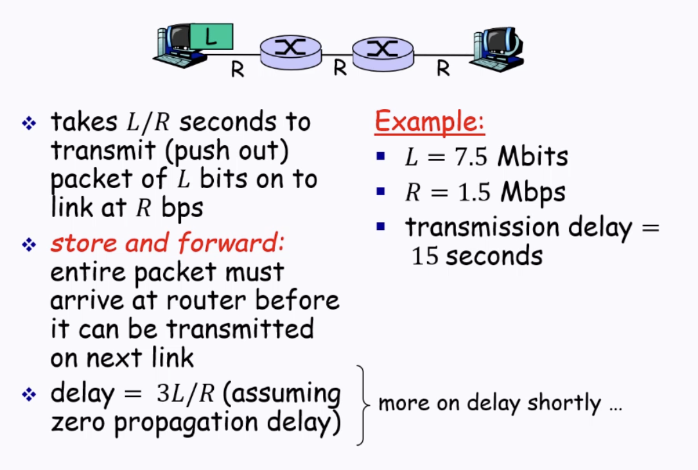

# CS4226: Internet Architecture Chapter 1

## Network Performance Metrics

1. Link Rate / Bandwith / Capacity
    - How many bits can be pushed to a link per time unit
2. Throughput (of a TCP/UDP flow)
    - How many bits can be communicated per unit time
3. End-To-End Delay
    - Processing Delay (programs running protocols + extract package headers, etc)
    - \+ Queueing Delay
    - \+ Transmission Delay
    - \+ Propagation Delay

4. Response time (Round Trip Delay (RTT))
    - Roughly 2x E2E delay
    - Not necessarily the same due to routing

## Packet Switching vs Circuit Switching

Packet Switching: Store and Forward

Packet Switching: Statistical Multiplexing
- Consider case where 2 devices send packets to the same network device
    - Bandwidth shared on demand (Statistical Multiplexing)
    - Sequence of A & B packets has no fixed timing pattern
- Allows more users to use the network (than circuit switching)
- Good for async (bursty) data

Circuit Switching
- Dedicated communication path between 2 endpoints
- Connection is exclusive until session ends

## Little's Law

Consider a system:
- Arrival rate λ
- Sojourn time W
    - Average time an item spends in the system
- No. of packets in system L

`L = λW` - The average number of customers in the system = Arrival Rate x Sojourn time.