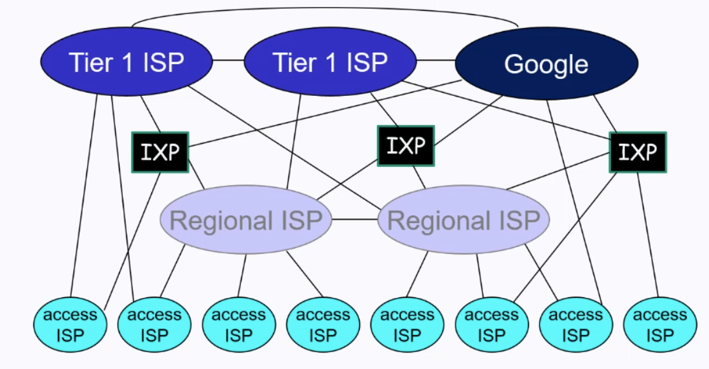
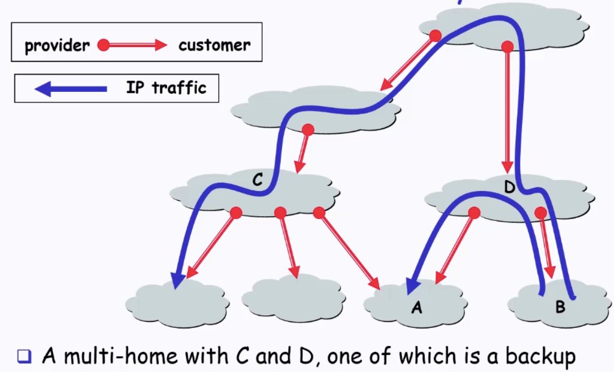
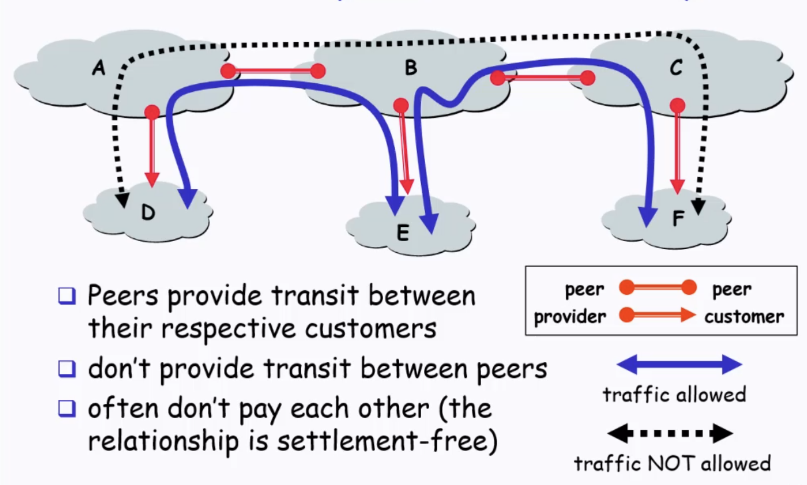
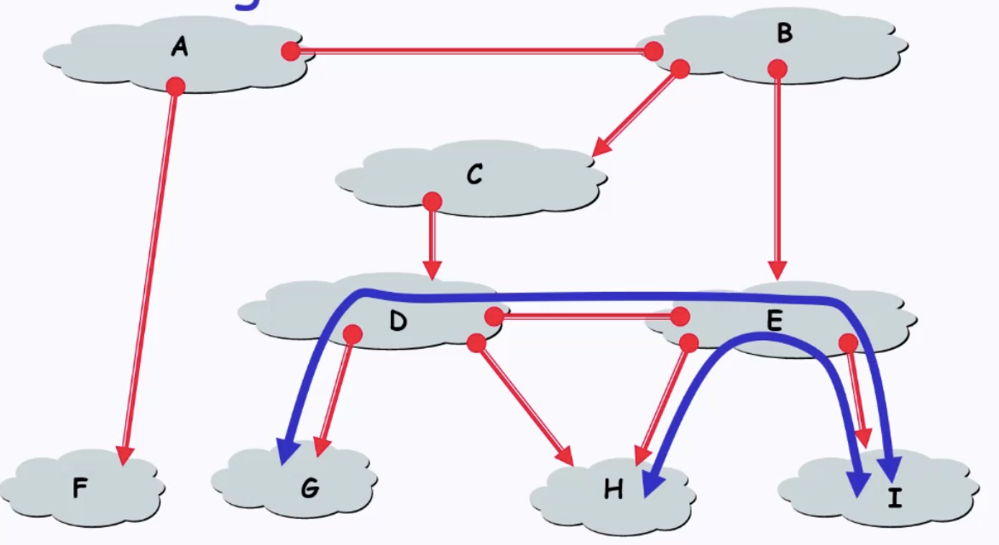

# Internet Interconnection

Recap from CS2105: Internet is a network of networks
- Base unit: Autonomous Systems (AS)
- How are they connected?
    - Internet peering (bilateral interconnection)
    - Internet exchange point (IXP) (multilateral connection)

## CS2105 Recap: Autonomous Systems

- Network of interconnected routers
    - Identifier: AS number (ASN)
        - Unique
    - Controlled by a single administrative domain
        - A company can have several ASNs
    - Common routing protocol and policy

- Small amount of well-connected large networks at the center
    - "Tier-1" ISPs
        - National / International coverage
    - Content providers

## Internet Peering

- Interconnection between Autonomous Systems (AS)
    - via **peering**
        - voluntary interconnection of administratively separate Internet network for the purpose of exchanging traffic between the "down-stream" users of each network
    - bilateral agreement between neighbor AS
    - depends on business relationships
        - **customer-provider**
            - customer has to pay provider for certain services
                - access to internet
                - ability to be reached from anyone
            - provider provides **transit service** to the customer
        - **peer-to-peer (settlement-free peering) relationship**
            - no payment from either side

### Customer-Provider hierarchy

- Customers have no incentive to allow traffic to go through it (**nontransit AS**)
    - corporate / campus network / content provider

### Peer-to-Peer 

- Peers provide transit between their respective customers
    - **do not provide transit between peers**
        - e.g traffic is not allowed for D <-> F, even though a link exists 
        - B has no incentive to help exchange packets from D to F
            - D, F are not B's customers
- Usually settlement-free (no payment from either side)

- Peers provide shortcuts
    - connectivity between customers "Tier 1" providers
        - They are all the way up at the network hierarchy
        - No upstream providers for them
            - Interconnection between tier 1 ISPs so that the networks are actually connected
            - Which are peer-to-peer
    - no need to go all the way up the hierarchy and back down (G -> D -> E -> I instead of G -> D -> C -> B -> E -> I)
        - instead just peer-to-peer
        - saves upstream transit cost as well (since it just goes between peers)

### Peer-to-peer: Peering Dilemma

- Peer?
    - Reduce upstream transit cost
    - Improve end-to-end performance
    - Be the only way to connect customers to some part of the internet (Tier 1 ISP)
- BUT
    - Peers are usually your competition
        - Although peering is beneficial for both sides
    - You would rather have customers ($$$)
    - Peering relationships may require periodic renegotiation

## ASes in the Internet

- Tier 1 AS / ISP
    - Access to entire internet only through settlement-free peering links
    - Top of the customer-provider hierarchy
        - No upstream provider
    - Peer with other Tier 1 AS / ISP to form a full mesh

- Lower layer providers (Tier 2, etc)
    - Provide transit to downstream customers

- Stub AS
    - Do not provide transit service
    - Connect to upstream providers
    - Most ASes

## Valley-free Property

- Valid AS paths
    - Single Peak
        - Uphill + Downhill
    - Single Flat Top
        - Uphill + 1 Peering + Downhill
    - Any sub-paths are valid too

- Invalid paths
    - Violate business rules because AS would be forced to carry traffic **for free** for networks that do not pay them
    - Examples
        - Provider -> customer -> peering
            - Provider carrying traffic from another provider and delivering to a peer of its customer
        - Provider -> customer -> provider
            - Customer acting as a transit for its provider
        - Peering -> Peering
            - Peers do not provide transit for each other (definition)
            - Only exchange traffic between their customers
        - Peering -> Provider
            - Cannot go uphill to a provider after peering
                - Asking your peer to send traffic up to provider for free

                
    