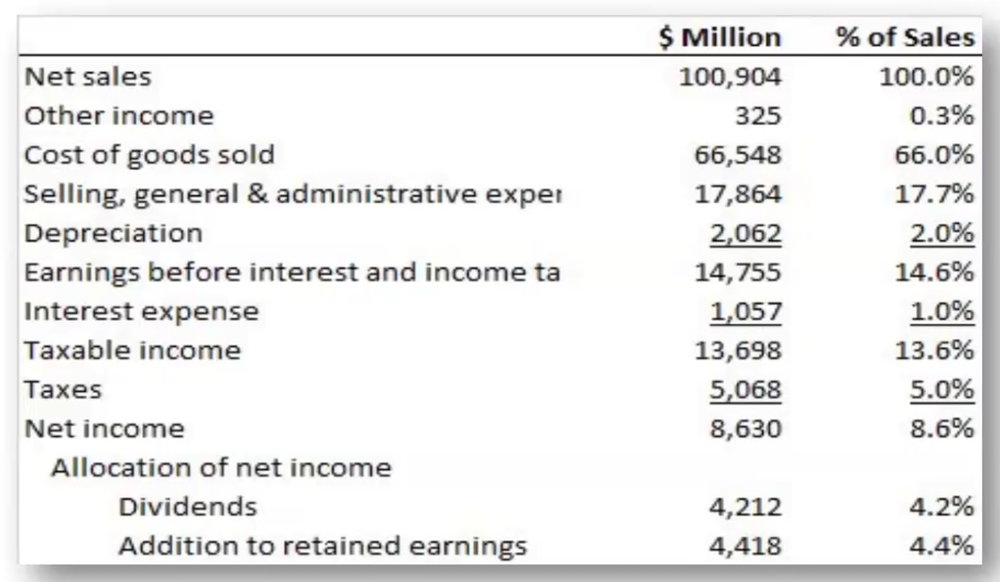

# Accounting Basics
From a managerial standport

## The Balance Sheet

### Intro

Financial Statement that:
- Show the value of the firm's assets and liabilities at a particular time
- A 'snapshot'
- ACCUMULATIVE (FROM START OF COMPANY UNTIL NOW)

Mainy split into two sides
- Generally sorted in decreasing order of liquidity
    - a.k.a how soon you can convert some asset to cash

Assets
- Current Assets
    - Cash & Securities
        - Security = financial asset that can be traded in the market
            - easy to convert to cash (sell with 1 button)
    - Recievables
        - Stuff that you are going to get (e.g you deliver a service, awaiting payment from your customer)
    - Inventories (Less liquid as the item has not been sold)
        - Raw material
        - Work in progress
        - Finished goods
- Fixed Assets
    - Tangible Assets
    - Intangible Assets


2 Conditions (to be added to the 'assets')
- Must come from a previous Transaction
- It must have future value


Liabilities + Equities
- Current Liabilities
    - Payables
        - I owe someone something (e.g I get the product, but I have not paid yet)
    - Short-term debt
        - < 1y
- Long-term Liabilities
    - After 1 year
- Shareholder Equity
    - What is left after paying the liabilities

Example:
```
Assets                         | Liabilities and Equity                     |
-------------------------------|--------------------------------------------|
Cash and marketable Securities | Debt due for repayment                     |
Accounts recievable            | Accounts payable                           |
Inventories                    | Total current liabilities (sum of above 2) |
Total current assets           | Long term debt                             |
Net fixed assets               | Equity                                     |
Total Assets                   | Total L&E                                  |
```

We can see that this is in decreasing order of liquidity, as mentioned above.


#### Underline

If you see an underline (e.g above net tangible fixed assets), you sum everything above

#### Other xxxx

Big companies use "Other current assets" / "Other current liabilities" to collate a bunch of assets that are too small to categorize elsewhere

#### PPE (Property, plant and equipment)

Purchase price of any fixed asset

Some assets (e.g company vehicles, chair) decrease in value over time
- Useful life of all common assets
- Less accumulated depreciation as an estimator of how much value these assets have lost over time
    - Net tangible fixed assets = PPE - less accumulated depreciation
    - Simple one is straight line depreciation:
        - Value - [current lifespan * (Value / total lifespan)]

#### Intangible Asset (Goodwill)

Remember the 2 conditions
- Must come from a previous transaction
- Must have future value

Example: Moderna
1. They got a patent
    - They can only put the money spent on getting a patent (i.e a transaction)
        - If you spend some money + There is a record of spending money

Example: You buy a company
1. You pay 150m. To acquire a company (its Assets - Liabilities of 100m) 
    - You lose 150m in current assets, and gain 100m.
    - Net -50m -> Inbalance in balance sheet
        - Solution: Create an asset called 'Goodwill'
            - Which takes the 50 million


#### Equity

Total Assets - Total liabilities = equity

Equity has 3 layers. (Perspective of I, the owner)

1. Common stock (and other paid-in capital)
    - Taking it public
    - Issue an IPO (Initial public offering)
        - Get money from shareholders
        - We issue shares
2. Retained earnings
    - Profit - Dividends you pay shareholders
        - "Reinvesting the money into the company"
3. Trasury stock
    - I buy back the stock from you, and I give you money
    - If you see a () / - / less in the value, it is a minus

### Another type of balance sheet: The common size balance sheet

Basically in percentages of **total assets** instead of raw money

Current Assets - Current Liabilities = Net working capital
- Generally should be positive
- Might not be good if its too high
    - e.g Too much inventory
    - Must strike a balance

### Book value vs Market value

Book value
- Value of assets / liability according to balance sheet
- Backward-looking (Historical cost adjusted for depreciation)

Market values
- Value of assets or liabilities were they to be resold in the market
- Forward looking (depends on profits investors expect the assets to provide)

Generally Accepted Accounting Principles (GAAP)
- Procedures for preparing financial statement

Market values are usually much higher than book values. (Book value of equity is cash that shareholders have contributed in the past + cash retained and reinvested by company)

Short-term liability market values should be close to book values
- e.g loan is pending, value of loan is close to market value

Long-term liability market values may be higher or lower than book value
- e.g bond. Series of cash payments and a final cash payment. Changes based on interest rates

tl;dr market values has to account for time value of money

Market value also follows the (assets = liabilities + equity) formula

## The Income Statement

Financial statement that shows the revenues, expenses and net income of a firm over a period of time (from an accounting perspective)

- Income statement is like a 'video' as opposed to a snapshot
- Over a period of time

Also part of the annual report that companies have to make

### Example


Revenue is generally a sum of the following:
- Net sales generally means revenue (money from customers)
- Other income (share market, bond market, etc)


- Cost
    - Cost of goods sold (COGS)
        - How much it costs to produce the goods
            - Inclusive of things like chef's salary, manager salary for a restaurant for example
        - Cost you can directly attribute to the sale
    - Selling, General & Administrative Expense (SG&A)
        - e.g You launch an ad campaign, cost goes here
        - Cost of an office
        - Cost of a CEO
        - Anything you can't directly attribute to the sale
    - Depreciation
        - Not accumulated depreciation (like a balance sheet)
        - Depreciation expense (depreciation for **THAT YEAR**)
        - In theory, it should be accumulated depreciation of year X + 1 - year X in the balance sheet.
            - However, that is not necessarily the case.
                - e.g You acquire a company. Its depreciation is also included

- Sum of the above = EBIT (earnings before interest and income tax)
    - Then you pay interest (for loans and stuff)
    - Interest does not come in balance sheet (Only the principal loan value)
        - Only in income statement

- Taxable income / Taxes
    - Net income = taxable income - taxes


- Now you allocate to share holders and stuff
    - Dividends
        - What you actually pay to the shareholders
    - Addition to retained earnings
        - Whatever is left
            - Goes to balance sheet in retained earnings


**EBIT Calculation**

EBIT = Total revenues + other income - costs - depreciation

## The Cash Flow Statement

### Profits vs Cash Flows

- Depreciation
    - Profits subtract depreciation (non-cash expense)
        - Its not cash leaving the system
        - Its "cash still with you"
    - Profits ignore cash expenditures on new capital (new assets you buy)
        - Income statment does not include cost associated with buying the first place.
        - e.g You buy equipment for a restaurant
            - These equipment lasts 10 years
            - Income statement: cost associated for a year
                - Asset is used for a longer period
    - To calc. cash produced by business, we have to add depreciation charge (not a cash payment) back to accounting profits and subtract expenditure on new capital equipment (cash payment)

- Accrual Accounting
    - Profits record income and expenses at time of sales, not when cash is collected (e.g delayed payment)
        - If I buy all my equipment on the last day of the year
        - If I sell all my goods on 1/1/new year
            - "Big loss last year, big profit this year"
                - Doesn't make sense.
    - Profits do not consider changes in working capital

### Cash Flow Statement

- Financial Statement that shows the firm's cash reciepts and cash payments over a period of time
    - A "video" of how cash was spent or obtained during the year

- Direct method of constructing cash flow
    - Add up all the reciepts
- Legally required to show by an indirect method
    - Construct cash flow statement from income and balance statement

- Cash can be 3 things
    - Operations
    - Investments
    - Financing
        - Loan: getting cash
        - Paying loan: losing cash
        - Paying dividends: losing cash

- In an ideal world, cash flow should match "cash and marketable securities" of year x+1 - year x, but:
    - Companies make acquisitions
    - Currencies fluctuate
    - Other complications

- Cash provided by operations:
    - Don't include
        - Cash
        - Short term debt
            - Included in cash flows from financing
                - Do not double count
        - Include everything in current assets and current liabilities (-ve) except for "cash and marketable securities" and "debt due for repayment"
    - Include accounts recievable
        - Income statement assumes they paid already
            - But it might not have been paid yet.
    - Include inventories
        - "Paying money to buy inventory"
        - If inventory decrease
            - Used to create a sale
            - Didn't spend money
    - General rule:
        - If asset increases in value
            - cash outflow
            - opposite applies
        - Liability exists:
            - Inflow of cash
                - You only owe someone money because they loaned you

- Cash flows from investments
    - Capital expenditure
        - e.g buying equipment to run the business
    - Sales of long-term assets
    - Other investing activities
        - e.g spend money to invest


- Cash provided for financing activities
    - If debt increases, what does that mean?
        - Someone gave you a loan
            - => Cash inflow
    - if debt decreases, you paid off a loan
        - paying cash
            - => Cash outflow

    - Dividends
        - Paying out => cash outflow
    - Similar concept applies to others.

### Free Cash Flow
- Cash available for distribution to investors after firm pays for new investments or additions to working capital

- Free Cash Flow = Net income + interest + depreciation - additions to net working capital + cashflow from investments

    - Alternatively:
        - Free cash flow = interest + cashflow from operations + cashflow from investments
## Taxes

- Companies get benefit out of taking more debt
    - Because debt is tax-exempt

### Taxation Principles
- Corporate Tax rate is 21% in the US.
    - In cases of losses, government does not give you money (negative taxes)
        - Instead, firm can carry losses forward, offset up to 80% of future years' income
    - Interest is not taxable

- Personal Income Tax
    - Taes have a major impact on financial decisions
    - **Marginal Tax rate** is the tax that the individual pays on each extra dollar of income
    - **Average tax rate** is `total tax bill / total income`
